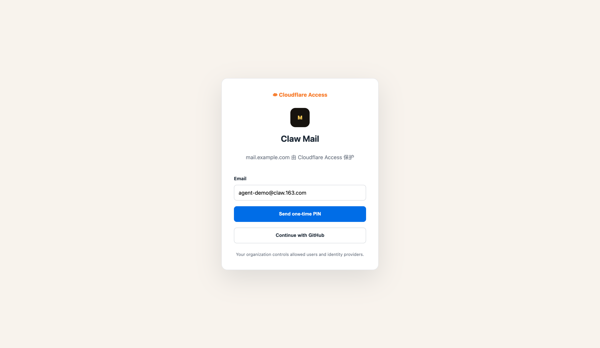
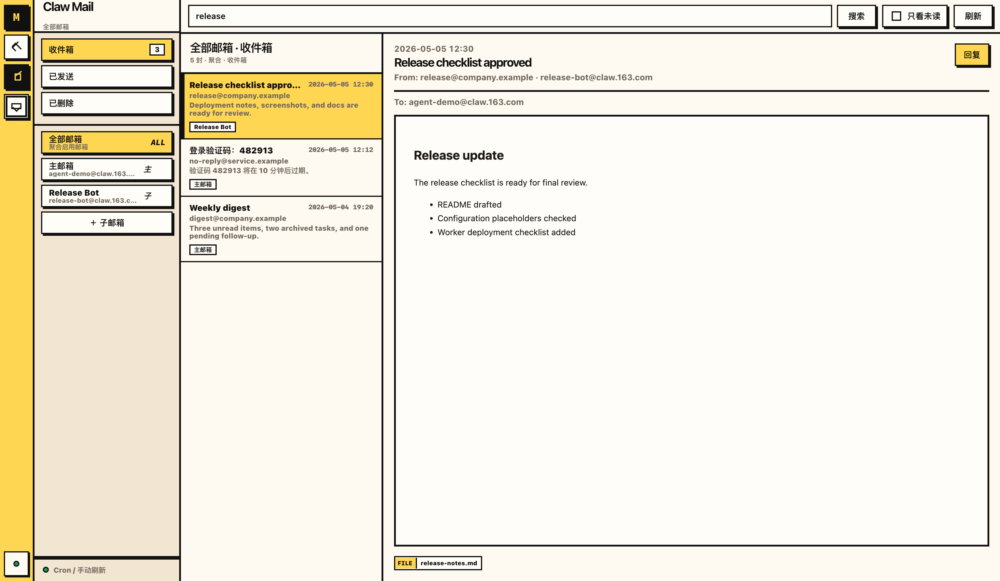
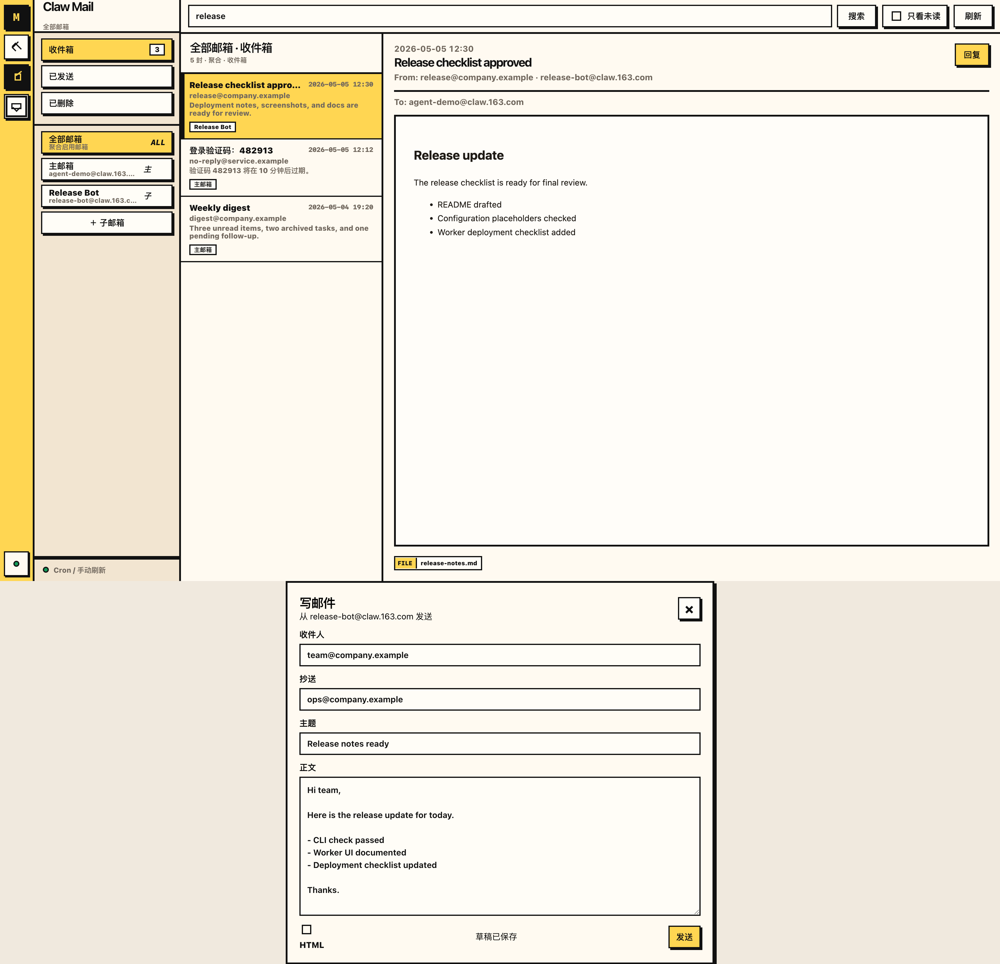
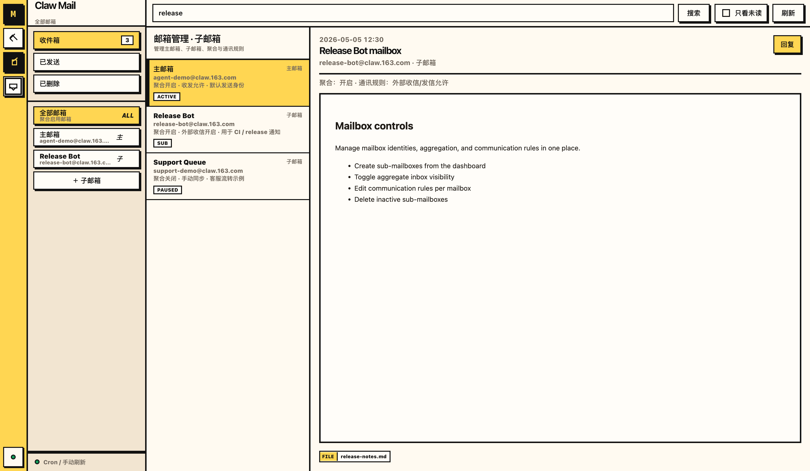

# Claw Mail Kit

Claw Mail Kit is a small CLI, local web UI, and optional Cloudflare Worker UI for using Claw 163 agent mail without running OpenClaw.

It supports:

- reading folders, listing/searching/reading messages, sending and replying from the terminal;
- a local browser UI served from `127.0.0.1`;
- creating and managing Claw agent sub-mailboxes;
- an optional private Cloudflare Worker deployment protected by Cloudflare Access, with D1-backed mailbox indexing.


## Screenshots

Cloudflare Access protects the hosted Worker UI before users reach the mailbox app. The product screenshots below use example `@claw.163.com` mailbox identities and sample message content.









## Requirements

- Node.js 18+
- npm
- Claw 163 agent mailbox credentials (`CLAW_USER` and `CLAW_API_KEY`)
- Optional, for the Cloudflare deployment: Wrangler, a Cloudflare account, D1, and Cloudflare Access

## Install

```bash
npm install
cp .env.example .env
```

Edit `.env`:

```dotenv
CLAW_USER=your-name@claw.163.com
CLAW_API_KEY=ck_live_xxxxxxxxxxxxxxxx
CLAW_HOST=https://claw.163.com
```

Do not commit `.env`, `.dev.vars`, `.secrets/`, `.wrangler/`, or downloaded artifacts.

## CLI usage

Run a health check:

```bash
npm run check
```

Common commands:

```bash
npm run clawmail -- folders
npm run clawmail -- list --limit 10
npm run clawmail -- search --keyword "OpenAI" --limit 10
npm run clawmail -- read --id '<message-id>'
npm run clawmail -- send --to person@example.com --subject 'Hello' --body 'Message body'
```

You can also call the executable directly:

```bash
node src/clawmail.mjs list --json
```

## Local web UI

```bash
npm run web
```

Open <http://127.0.0.1:8765>.

The local UI reads `.env` and stores sensitive mail-cli state under `.secrets/`, which is ignored by Git.

## Cloudflare Worker deployment

The Worker variant lives in `worker/` and serves `worker/public/` assets plus `/api/*` routes.

1. Create D1 and update `wrangler.jsonc`:

   ```bash
   wrangler d1 create claw_mail
   ```

2. Apply migrations:

   ```bash
   wrangler d1 migrations apply claw_mail --remote
   ```

3. Configure secrets:

   ```bash
   wrangler secret put APP_ENCRYPTION_KEY
   wrangler secret put ACCESS_TEAM_DOMAIN
   wrangler secret put ACCESS_AUD
   ```

4. Typecheck / dry run:

   ```bash
   npm run cf:typecheck
   npm run cf:deploy:dry-run
   ```

5. Deploy:

   ```bash
   wrangler deploy
   ```

For local Worker development:

```bash
cp .dev.vars.example .dev.vars
npm run cf:migrate:local
npm run cf:dev
```

`DEV_BYPASS_AUTH=true` is intended only for local development.

## Repository layout

- `src/clawmail.mjs` — CLI and Coremail proxy helpers.
- `src/web.mjs` — local web server.
- `web/` — local web UI assets.
- `worker/src/` — Cloudflare Worker backend.
- `worker/public/` — Worker UI assets.
- `worker/migrations/` — D1 migrations.
- `docs/` — protocol and deployment notes.
- `vendor/` — inspected upstream package snapshots needed for reference.

## Security notes

- Secrets are read from `.env`, process env, Worker secrets, or encrypted D1 settings.
- API keys, auth responses, cookies, and access tokens are not intended to be tracked.
- The Worker deployment should be protected by Cloudflare Access in production.
