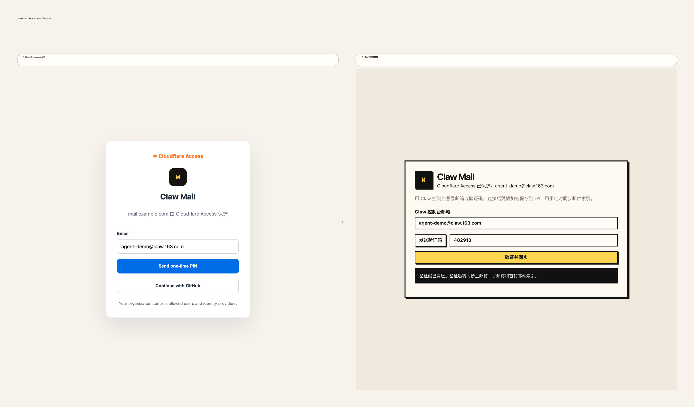
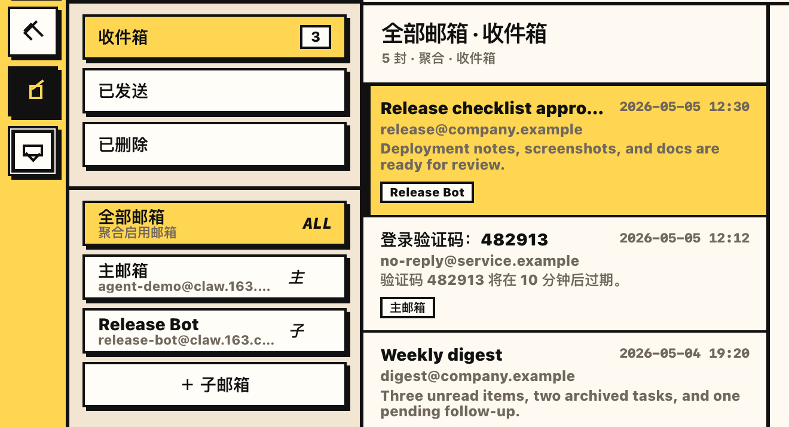

# Claw Mail Kit

Claw Mail Kit is a repository for three related Claw 163 agent-mail surfaces: a CLI, a local browser UI, and a hosted Cloudflare Worker UI. They share protocol knowledge but have separate runtime boundaries.

It supports:

- **CLI** (`cli/`) for folders, list/search/read, send/reply, realtime watch, and agent mailbox account operations;
- **local web UI** (`local/`) served from `127.0.0.1` for single-machine use;
- **Cloudflare Worker UI** (`worker/`) protected by Cloudflare Access, with D1-backed mailbox indexing;
- **agent skill package** (`skills/`) so users can install project guidance with `npx skills`.

## Screenshots

Cloudflare Access protects the hosted Worker UI before users reach the mailbox app. The product screenshots below use example `@claw.163.com` mailbox identities and sample message content.







## Requirements

- Node.js 18+
- npm
- Claw 163 agent mailbox credentials (`CLAW_USER` and `CLAW_API_KEY`)
- Optional, for the Cloudflare deployment: Wrangler, a Cloudflare account, D1, and Cloudflare Access

## Install

```bash
npm install
cp .env.example .env
```

Edit `.env`:

```dotenv
CLAW_USER=your-name@claw.163.com
CLAW_API_KEY=ck_live_xxxxxxxxxxxxxxxx
CLAW_HOST=https://claw.163.com
```

Do not commit `.env`, `.dev.vars`, `.secrets/`, `.wrangler/`, or downloaded artifacts.

## CLI usage

Run a health check:

```bash
npm run check
```

Common commands:

```bash
npm run clawmail -- folders
npm run clawmail -- list --limit 10
npm run clawmail -- search --keyword "OpenAI" --limit 10
npm run clawmail -- read --id '<message-id>'
npm run clawmail -- send --to person@example.com --subject 'Hello' --body 'Message body'
```

## Local web UI

```bash
npm run web
```

Open <http://127.0.0.1:8765>.

The local UI reads `.env` and stores sensitive mail-cli state under `.secrets/`, which is ignored by Git.

## Cloudflare Worker deployment

The Worker variant lives in `worker/` and serves `worker/public/` assets plus `/api/*` routes.

1. Create D1 and update `wrangler.jsonc`:

   ```bash
   wrangler d1 create claw_mail
   ```

2. Apply migrations:

   ```bash
   wrangler d1 migrations apply claw_mail --remote
   ```

3. Configure secrets:

   ```bash
   wrangler secret put APP_ENCRYPTION_KEY
   wrangler secret put ACCESS_TEAM_DOMAIN
   wrangler secret put ACCESS_AUD
   ```

4. Typecheck / dry run:

   ```bash
   npm run cf:typecheck
   npm run cf:deploy:dry-run
   ```

5. Deploy:

   ```bash
   wrangler deploy
   ```

For local Worker development:

```bash
cp .dev.vars.example .dev.vars
npm run cf:migrate:local
npm run cf:dev
```

`DEV_BYPASS_AUTH=true` is intended only for local development.

## Agent skill

Install directly from GitHub:

```bash
npx skills add catoncat/claw-mail-kit --full-depth --skill claw-mail --agent codex --yes
```

Or, after cloning this repository, install from the local checkout:

```bash
npx skills add . --full-depth --skill claw-mail --agent codex --yes
```

To inspect installable skills first:

```bash
npx skills add . --full-depth --list
```

## Repository layout

- `cli/` — CLI and Coremail proxy helpers.
- `local/server.mjs` — local web server.
- `local/public/` — local web UI assets.
- `worker/src/` — Cloudflare Worker backend.
- `worker/public/` — Worker UI assets.
- `worker/migrations/` — D1 migrations.
- `skills/` — installable agent skills.
- `docs/` — protocol, layout, deployment notes, screenshots, and references.
- `vendor/` — inspected upstream package snapshots needed for reference.

See `docs/project-layout.md` for the CLI/local/Worker boundary split.

## Security notes

- Secrets are read from `.env`, process env, Worker secrets, or encrypted D1 settings.
- API keys, auth responses, cookies, and access tokens are not intended to be tracked.
- The Worker deployment should be protected by Cloudflare Access in production.
